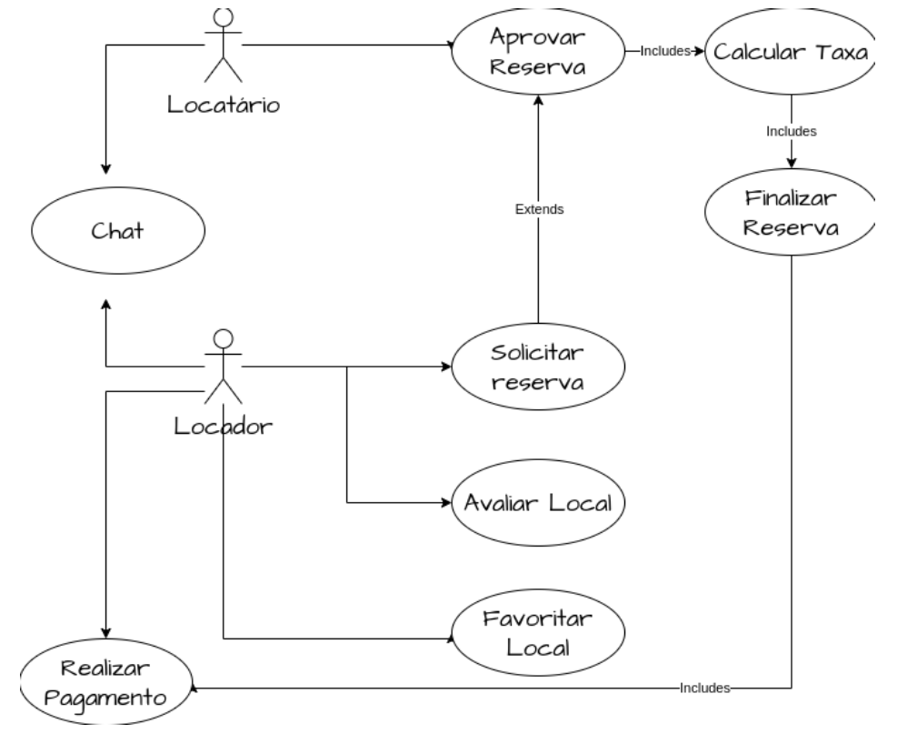

# 4. Diagrama de Caso de Uso

Abaixo, está o diagrama de casos de uso do sistema, que representa as interações entre os atores e as principais funcionalidades do sistema.

## 4.1 Descrição de Casos de Uso

### Solicitar reserva

- Descrição: Este caso de uso é iniciado pelo locatário (cliente que alugará o espaço) quando requisita ao sistema para solicitar uma reserva de um locador (dono do estabelecimento). Através do preenchimento de um formulário com os dados do locador e da data e horário desejado da reserva, essa solicitação será realizada.
- Objetivo: Possibilitar que ocorra a solicitação da reserva
- Ator envolvido: Locatário.

---

### Descrição geral do conjunto: Aprovar reserva, calcular taxa, finalizar reserva, realizar pagamento

- Descrição: Estes casos de uso são iniciados pelo locador quando requisita ao sistema para aprovar uma reserva de um locatário. Ao aprovar a solicitação de reserva feita anteriormente pelo locatário, a taxa é calculada a partir do valor do local e do tempo de aluguel/reserva desejado pelo cliente.
- Objetivo: possibilitar que ocorra a aprovação da reserva, cálculo e pagamento.
- Atores envolvidos: Locatário e Locador

---

### Chat

- Descrição: Este caso de uso é iniciado pelo locatário ou locador quando desejam entrar em contato com o outro por meio do chat.
- Objetivo: possibilitar que ocorra a solicitação da reserva e a comunicação entre as partes envolvidas no aluguel de um espaço.
- Ator envolvido: Locatário e Locador.

---

### Favoritar local

- Descrição: Este caso de uso é iniciado pelo locatário quando ele deseja “favoritar” algum local e salvá-lo como um favorito. Desse modo, locais salvos como favorito, serão dispostos em uma listagem à parte, facilitando o acesso a eles.
- Objetivo: Possibilitar a funcionalidade dos favoritos, facilitar o acesso do cliente aos locais que mais utiliza.
- Ator envolvido: Locatário.

---

### Avaliar local

- Descrição: Este caso de uso é iniciado pelo locatário quando o mesmo deseja avaliar um local. Assim, ele atribuirá uma nota e uma descrição sobre a sua experiência naquele local.
- Objetivo: Possibilitar que usuários locatário avaliem os locais que alugarem, auxiliando outros usuários a encontrar o melhor local possível.
- Ator envolvido: Locador
