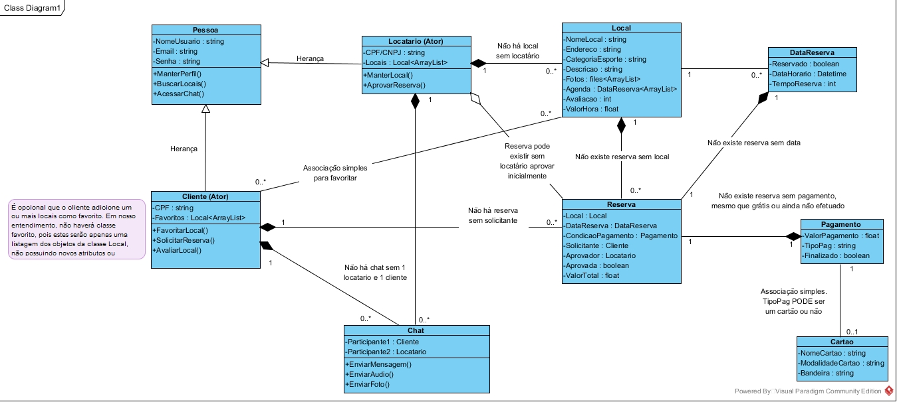

# 5. Diagrama de Classes

&nbsp;&nbsp;&nbsp;&nbsp;&nbsp;
Abaixo está o diagrama de classes do sistema, que representa a estrutura de classes e as relações entre elas de maneira detalhada, de modo a demonstrar seus principais atributos, métodos e relações. Desse modo, é possível compreender de maneira geral as funcionalidades do sistema e quais estruturas de dados deverão ser desenvolvidas durante a etapa de programação do aplicativo. Nesta foto do diagrama, também estão presentes algumas observações e considerações, com o objetivo de oferecer um detalhamento mais aprofundado quando necessário ou explicitar uma particularidade de algum das classes ou comportamentos presentes no sistema.

