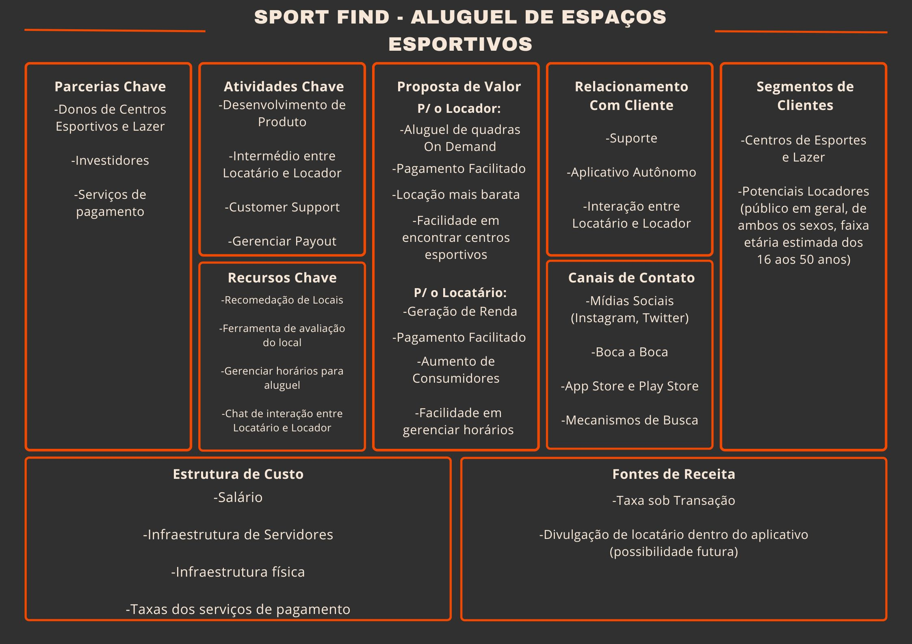

# 2. Descrição do Projeto

## 2.1 Visão Geral do Projeto

&nbsp;&nbsp;&nbsp;&nbsp;&nbsp;
O SportFind será um aplicativo para Android e IOS que tem o objetivo de facilitar a comunicação entre locadores e locatários de espaços esportivos, como campos de futebol, quadras de futsal, vôlei, basquete, entre outros. O locador terá facilidade em buscar uma área de lazer, salão de festas, quadras esportivas e outros com uma busca com filtros que o agradam. Já o locatário terá facilidade em divulgar sua área para o maior número de pessoas. Ambos poderão trocar mensagens por um sistema de chat para tirar dúvidas. Além disso, o sistema de pagamento será simples e rápido com uma taxa baixa.

### 2.1.1 Canvas do Projeto

## 2.2 Stakeholders

&nbsp;&nbsp;&nbsp;&nbsp;&nbsp;
Principais partes interessadas (stakeholders) envolvidas no projeto:

- Gabriel Augusto Weber - Gerente do Projeto e desenvolvedor back-end;
- Hiury Gabriel Tressoldi - Gerente de Finanças e desenvolvedor front-end;
- Murilo Vizzotto de Souza - Gerente de Marketing e desenvolvedor fullstack;
- Pessoas Físicas praticantes de esportes coletivos - alugar os locais disponíveis no aplicativo;
- Pessoas Físicas donas de quadras e espaços esportivos - fornecer espaços a serem alugados;
- Pessoas Jurídicas que gerenciam espaços esportivos - fornecer os espaços a serem alugados.

## 2.3 Objetivos

&nbsp;&nbsp;&nbsp;&nbsp;&nbsp;
Liste os principais objetivos do projeto, descrevendo o que se pretende alcançar com o desenvolvimento e implementação do software. Os objetivos devem ser específicos, mensuráveis, alcançáveis, relevantes e temporais (SMART).

### 2.3.1 Objetivo Geral

- Facilitar o contato entre locadores de quadras esportivas e potenciais locadores através de uma aplicativo de busca onde os potenciais clientes podem encontrar quadras ou espaços de lazer disponíveis para aluguel em sua região.

### 2.3.2 Objetivos Específicos

- Promover a prática esportiva na região oeste de Santa-Catarina;
- Oferecer uma ferramenta para facilitar a organização de agenda dos donos dos espaços;
- Oferecer uma maneira prática e segura de efetuar o pagamento da reserva do local;
- Manter um perfil com fotos e informações dos espaços esportivos, auxiliando no negócio do locador;
- Permitir que os clientes avaliem locais que tenham visitado;
