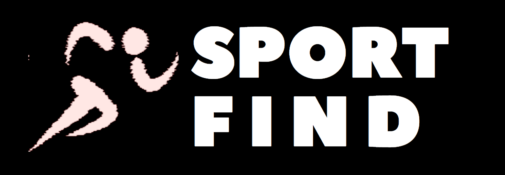

# Visão Geral do Projeto

---

## Tópicos do projeto

1. [Introdução](topicos/introducao.md)
2. [Descrição do Projeto](topicos/descricao.md)
3. [Principais Recursos e Funcionalidades](topicos/recursos.md)
4. [Diagrama de Caso de Uso](topicos/casosDeUso.md)
5. [Diagrama de Classes](topicos/classes.md)
6. [Protótipos de Telas](topicos/prototipos.md)
7. [Cronograma e Entrega](topicos/cronograma.md)
8. [Riscos e Mitigação](topicos/riscos.md)
9. [Custos e Orçamento](topicos/custos.md)
10. [Considerações Finais](topicos/consideracoes.md)

[Instalação]("https://www.google.com")
